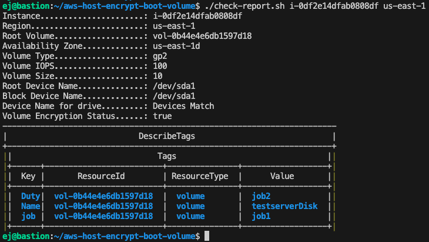

# aws-host-encrypt-boot-volume
###### tech debt solution
Consdering Cybersecurity these days 

- this is a procedure that can be used for encrypting volumes
- we had some legacy servers that needed to be encrypted 
- there are pros and cons of scripts and console; and each needs focus

 
<u>Prerequisties</u>   

- AWS command line aws-cli/1.33.13 or later  
- Terraform v1.8.5 or later

 
<u>Testing with</u>   

- Ubuntu 22.04.4 LTS  
- Any udpated Linux should work

Here are the steps

1. Ensure you are setup for AWS Command Line with your server
2. Get your Server instance ID and note the region
3. Get a report before starting <pre>
./check-report < instance > < region > </pre>
4. Encrypt the drive (snapshot and volume will be saved) <pre> ./encrypt-ebs-vol.sh < instance > < region >  </pre>
5. Get a report when finished <pre>
./check-report < instance > < region > </pre>
6. Compare reports to see the volume and encryption updates
7. Check and compare the old volume and snap shot remains

Please see before and after Snapshots 

See below the after of the same above screen shot
- notice the volume ID changed 
- notice the Entryption status is now True
- all tags and device names should remain the same

Here is a log of the encryption happening 

