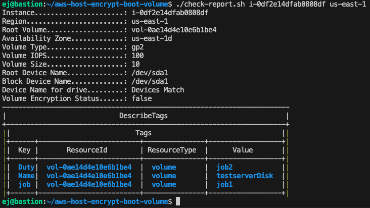

# aws-host-encrypt-boot-volume
###### tech debt solution
Consdering Cybersecurity these days 

- this is a procedure that can be used for encrypting volumes
- we had some legacy servers that needed to be encrypted 
- after doing them in the console; feeling a bit of pressure 

 
<u>Prerequisties</u>   

- AWS command line aws-cli/1.33.13 or later  
- Terraform v1.8.5 or later

 
<u>Testing with</u>   

- Ubuntu 22.04.4 LTS  
- Any udpated Linux should work

Please see before and after Snapshots 

See below the after of the same above screen shot
- notice the volume ID changed 
- notice the Entryption status is now True
- all tags and device names should remain the same

